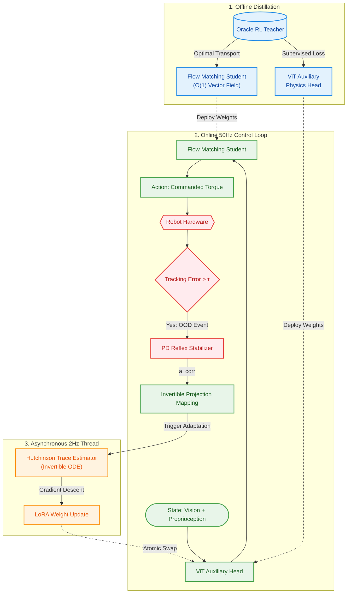

## Introduction
Fast inference is critical for stable robot control. Generative policies like Diffusion Models often miss strict latency deadlines (e.g., 50Hz) because they require multiple denoising steps.

We introduce **Reversible Flow Adaptation (RFA)**. RFA distills an RL Teacher into a Flow Matching Student, achieving single-step ($O(1)$) inference for real-time control and supporting test-time adaptation.

## Related Work
- **Generative Policies**: Diffusion Models are slow. Flow Matching offers a faster, deterministic path from noise to data.
- **Test-Time Adaptation (TTA)**: Standard adaptation is too slow. RFA uses LoRA and trace estimation for efficient, continuous updates.
- **Residual Control**: Instead of just using PD controllers as a fallback, we use their corrective torques to train the generative model.

## Methodology
RFA runs in three phases: offline distillation, online deployment, and asynchronous adaptation.

### Flow Matching Distillation
We distill an RL Teacher (PPO) into a Flow Matching Student. Using Optimal Transport, the student learns a deterministic vector field $v_t = x_1 - x_0$. A `PhysicsHead` predicts parameters like friction ($\mu$) and mass ($m$) to ground vision features in physical reality.

### OOD Survival & PD Reflexes
Generative policies often fail in unfamiliar states. If tracking error exceeds a threshold $\tau$, a PD stabilizer injects corrective torques ($a_{corr}$). We map these torques back to the model as a continuous learning signal.

### Test-Time Adaptation
To adapt in real-time without halting the robot:
1. **Trace Estimator:** We estimate the Jacobian trace using 5 noise samples, massively reducing compute costs.
2. **LoRA Fine-Tuning:** Gradients only update low-rank adaptation (LoRA) modules.

A background thread computes these updates at 2Hz and injects them seamlessly into the 50Hz control thread.

### Architecture
The pipeline from offline distillation to online adaptation:

## Experiments

### Distillation Convergence
Does distillation stay stable? Yes. As the Teacher's PPO loss drops, the Student's Vector Field loss perfectly mirrors it. Optimal Transport provides a highly stable learning signal.

<iframe src="js/posts/ref-001/01_distillation_convergence_teacher.html" width="100%" height="600px" frameborder="0"></iframe>
<iframe src="js/posts/ref-001/01_distillation_convergence_student.html" width="100%" height="600px" frameborder="0"></iframe>

### Hardware Inference Speedup
Diffusion models require multiple steps, eating up the 20ms control budget. Our Flow Matching Student requires just one step. As shown below, this slashes inference latency to **~0.3ms**—a ~15x speedup that leaves plenty of headroom for vision and planning.

<iframe src="js/posts/ref-001/02_hardware_efficiency.html" width="100%" height="600px" frameborder="0"></iframe>

### OOD Adaptation Survival
Models often fail in unfamiliar states. We logged over 15 million corrective torques injected by the PD Reflex Stabilizer. Even during extreme interventions, our adaptation pipeline successfully converted these reflexes into stable learning signals, keeping the robot stable without a catastrophic failure.

<iframe src="js/posts/ref-001/03_ood_adaptation_survival.html" width="100%" height="600px" frameborder="0"></iframe>

## Summary
RFA fixes the latency bottleneck of generative policies. By distilling an RL Teacher into a single-step Flow Matching model and continuously adapting via LoRA, RFA delivers ultra-fast, stable control in the real world.
