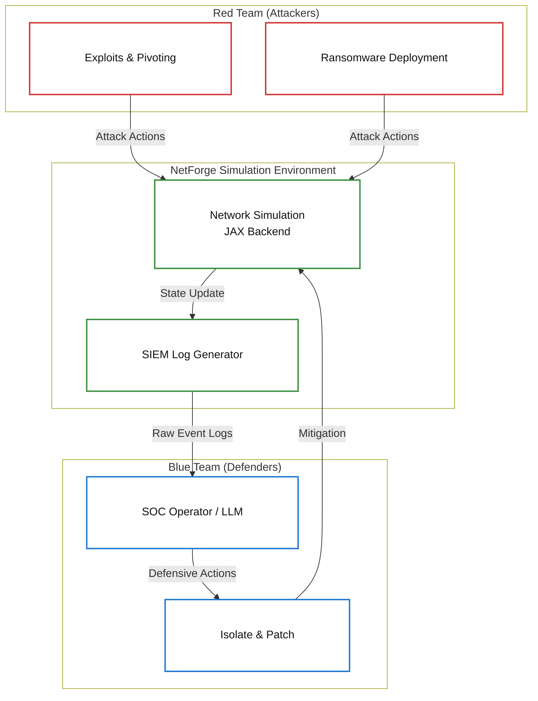

## Introduction
Cybersecurity research in Reinforcement Learning often lacks environments that are both highly scalable and grounded in realistic scenarios. **NetForge RL** bridges this gap. It provides a Multi-Agent RL (MARL) environment where Red agents attack a simulated network and Blue agents defend it, built entirely on PettingZoo with a robust JAX backend.

## Key Features

- **Partial Observability**: Blue agents only see the network through SIEM logs. Red agents operate under the fog of war.
- **Realistic Telemetry**: Every action in the environment generates real Windows and Sysmon event strings, ensuring policies learned are tied to actual telemetry rather than abstract states.
- **MITRE ATT&CK Aligned**: Exploits and techniques map directly to real-world CVEs (e.g., MS17-010, CVE-2019-0708).
- **LLM Agent Ready**: You can plug in advanced language models like GPT-4 or Llama3 to act as SOC operators, reading the raw logs and issuing defensive commands.

## Architecture & Workflow

The environment continuously simulates the interactions between attackers and defenders:

## Performance Scaling with JAX

A significant bottleneck in RL cybersecurity simulations is the environment step time. NetForge overcomes this using pure JAX. By leveraging `vmap` and `jit` compilation, the backend supports massively parallel rollouts.

We observed speeds exceeding **1M+ steps/sec** when running 4096 parallel environments on a standard modern CPU, which allows models to explore deep adversarial strategies efficiently.

## Summary
NetForge RL provides a highly efficient, JAX-based arena for Multi-Agent Cybersecurity training. By combining the speed of vectorized environments with the realism of actual telemetry and MITRE-aligned techniques, it sets a new standard for adversarial network research.
